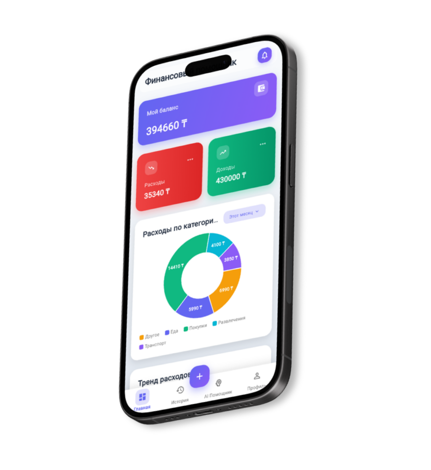
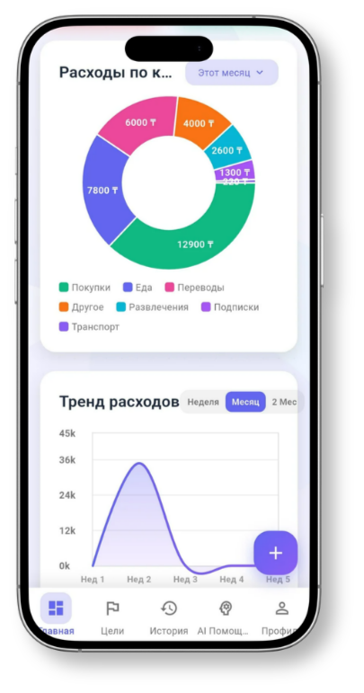
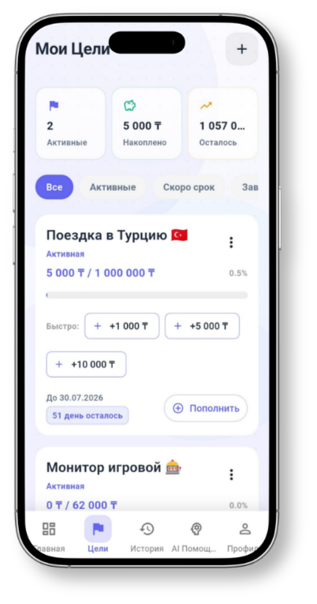
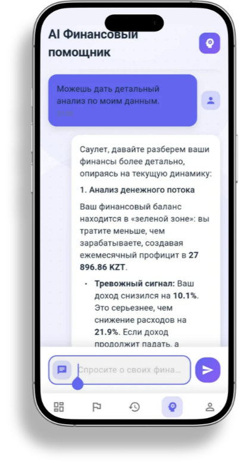
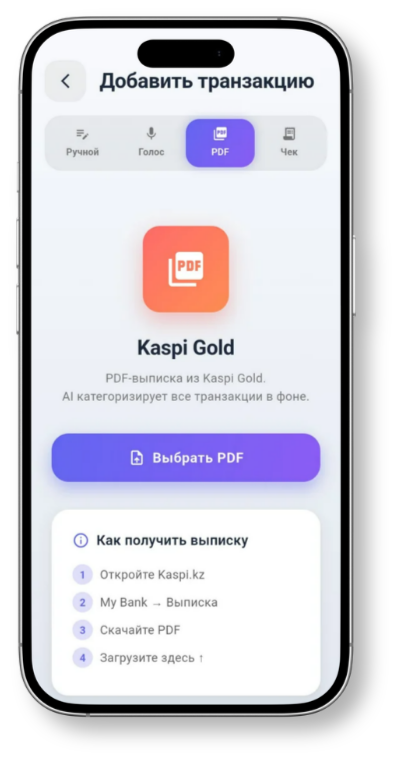

<div align="center">

# 💰 aiFinance

**AI-powered personal finance assistant built with Go**

Track expenses · Set savings goals · Get AI insights · Import bank statements

[](https://aifinance-eta.vercel.app/)
[](https://go.dev/)
[](https://www.postgresql.org/)
[](https://render.com/)

<br/>



</div>

> [!NOTE]
> Google Sign-In is currently available **only on the mobile app**. The web version supports email/password authentication.

---

## ✨ Features

| Feature | Description |
| :--- | :--- |
| 📊 **Smart Analytics** | Interactive charts with category breakdowns, spending trends, and net flow analysis |
| 🤖 **AI Financial Advisor** | Chat with an AI that knows your financial data and gives personalized advice |
| 🎯 **Savings Goals** | Create goals, track progress, and get deadline reminders |
| 📄 **Bank Statement Import** | Upload Kaspi Gold PDF statements — transactions are parsed and auto-categorized by AI |
| 🔐 **Secure Auth** | JWT-based authentication with email verification and Google OAuth |
| 📧 **Email Notifications** | Verification codes and alerts via Gmail API |

---

## 📱 Screenshots

<p align="center">
  
  
  
  
</p>

<p align="center">
  <sub>Analytics & Trends · Savings Goals · AI Advisor · Bank Statement Import</sub>
</p>

---

## 🏗 Architecture

```
cmd/api/            → Application entrypoint
internal/
├── config/         → Environment configuration
├── app/            → App initialization & lifecycle
├── handler/        → HTTP request handlers (Gin)
├── usecase/        → Business logic layer
├── repository/     → Data access layer (GORM + PostgreSQL)
├── domain/         → Domain models & interfaces
├── ai/             → OpenRouter AI client
├── email/          → Gmail API integration
├── worker/         → Background categorization worker
├── middleware/     → Auth & CORS middleware
└── db/             → Database connection & embedded SQL migrations
pkg/
├── jwt/            → JWT token service
├── kaspi/          → Kaspi Bank PDF parser
├── google/         → Google OAuth token verifier
├── password/       → Bcrypt hashing utilities
└── validator/      → Input validation helpers
```

---

## 🛠 Tech Stack

- **Language:** Go 1.25
- **Framework:** Gin
- **Database:** PostgreSQL (Supabase)
- **ORM:** GORM
- **AI:** OpenRouter API (Gemini, GPT, etc.)
- **Auth:** JWT + Google OAuth2
- **Email:** Gmail API (OAuth2)
- **Deploy:** Render (backend) · Vercel (frontend)

---

## 🚀 Getting Started

### Prerequisites

- Go 1.25+
- PostgreSQL instance (or [Supabase](https://supabase.com/) free tier)

### Setup

1. **Clone the repository**
   ```bash
   git clone https://github.com/SauletTheBest/aiFinance.git
   cd aiFinance
   ```

2. **Configure environment** — create a `.env` file in the project root:
   ```env
   DB_HOST=localhost
   DB_PORT=5432
   DB_USER=postgres
   DB_PASSWORD=your_password
   DB_NAME=postgres
   DB_SSLMODE=disable
   JWT_SECRET=your_jwt_secret
   PORT=8080
   OPENROUTER_API_KEY=your_openrouter_key
   OPENROUTER_MODEL=google/gemini-2.5-flash
   CLIENT_ID=your_google_client_id
   CLIENT_SECRET=your_google_client_secret
   REFRESH_TOKEN=your_gmail_refresh_token
   GMAIL_SENDER=your_email@gmail.com
   ANDROID_CLIENT_ID=your_android_client_id
   ```

3. **Run the server**
   ```bash
   cd cmd/api
   go run main.go
   ```
   The API will be available at `http://localhost:8080`

---

## 📡 API Reference

All protected routes require header: `Authorization: Bearer <token>`

### Auth `/api/auth`

| Method | Endpoint | Description |
| :--- | :--- | :--- |
| POST | `/register` | Create a new account |
| POST | `/login` | Login & receive JWT token |
| POST | `/google` | Google OAuth sign-in |
| POST | `/verify` | Verify email with code |

### Transactions `/api/transactions`

| Method | Endpoint | Description |
| :--- | :--- | :--- |
| GET | `/` | List all transactions (`?page=1&limit=10`) |
| GET | `/:id` | Get transaction by ID |
| POST | `/` | Create a transaction |
| PUT | `/:id` | Update a transaction |
| DELETE | `/:id` | Delete a transaction |

### Statement Import `/api/statements`

| Method | Endpoint | Description |
| :--- | :--- | :--- |
| POST | `/upload` | Upload Kaspi PDF statement (`multipart/form-data`) |

### Statistics `/api/statistics`

| Method | Endpoint | Description |
| :--- | :--- | :--- |
| GET | `/` | Financial stats (`?period_start=...&period_end=...`) |
| GET | `/balance` | Current balance |
| PUT | `/balance` | Set opening balance |

### Goals `/api/goals`

| Method | Endpoint | Description |
| :--- | :--- | :--- |
| GET | `/` | List all goals |
| GET | `/:id` | Get goal details |
| POST | `/` | Create a new goal |
| PUT | `/:id/contribute` | Add money to a goal |
| DELETE | `/:id` | Delete a goal |

### AI Chat `/api/chat`

| Method | Endpoint | Description |
| :--- | :--- | :--- |
| POST | `/` | Send a message to AI financial advisor |

---

<div align="center">

Made with by [SauletTheBest](https://github.com/SauletTheBest)

</div>
